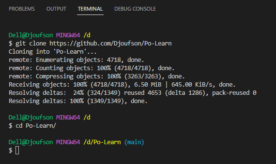
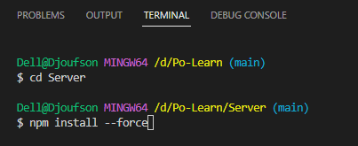
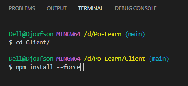

# **PoLearn**
Cette application est realisée à titre de Controle Continu pour l'évaluation de Dev Web

Elle est une **platforme d'apprentissage en ligne**, communément appelée **E Learning**

## **Clone du projet**
Afin de pouvoir travailler avec ce repository, effectuer les commandes suivantes (Git doit etre installé sur le PC)

``` git
git clone https://github.com/Djoufson/Po-Learn
```


## **Lancement**
Pour lancer cette application, il est primordial de lancer séparement l'hote du Serveur Node JS, et celui du Client React JS

## **Serveur**
`npm install --force`

Pour installer la liste des dependances



`npm start`

Lance le serveur en ecoute des requetes sur l'addrese [http://localhost:8000](http://localhost:8000)

## **Client**

`npm install --force`

Pour installer la liste des dependances



`npm start`

Lance le client React JS sur l'addrese [http://localhost:3000](http://localhost:3000)